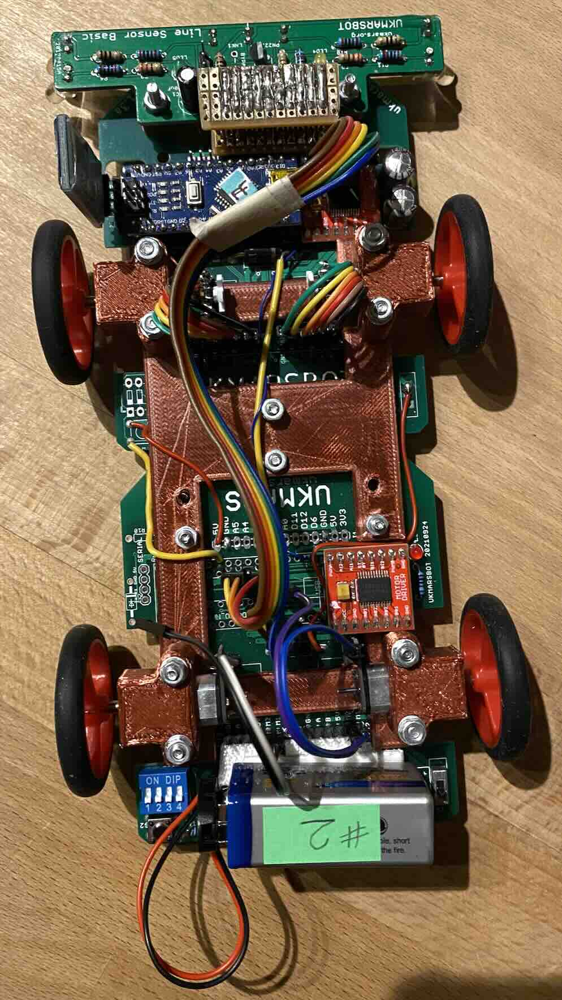
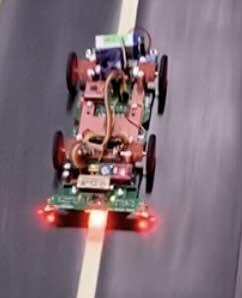
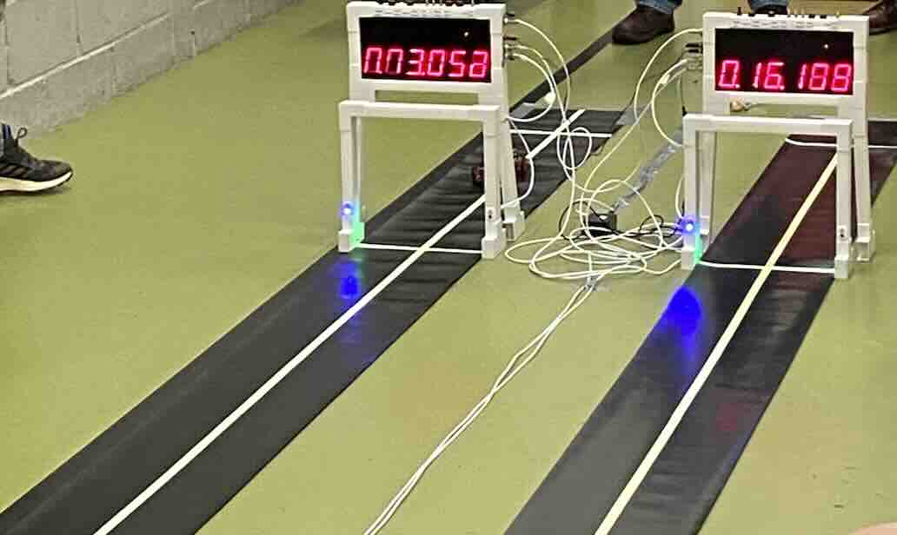

This is provisional code for drag racing - for a robot loosely based on a UKMARSbot.

Code is written in Forth (using Flashforth on the Arduino Nano using a ATMega328P).

Written by Peter Probin and Rob Probin. Copyright (c) 2024 Rob Probin and Peter Probin

Licensed under the MIT license.

See https://ukmars.org/projects/ukmarsbot/

See https://github.com/ukmars/ukmarsbot

For rules see: https://ukmars.org/contests/contest-rules/drag-race/

Each lane on the track is 7.2 metres long with a minimum width of 0.26 metres. A white line is in the middle of the lane. The start box occupies the first 375mm of the track with the start line. The braking area comprises the final 1.2 m of the track. Mice must stop before any part of the mouse travels beyond the braking area length, or incur a 5 second time penalty. The drag race robots must be manually started after the start signal is displayed in the end gate.

